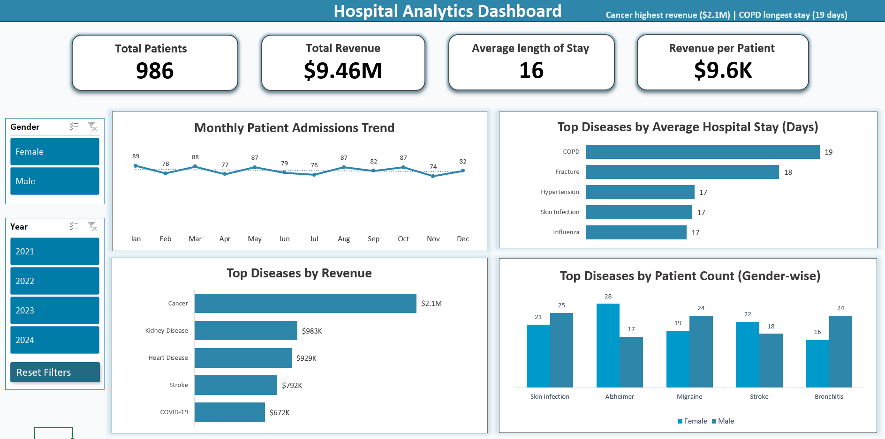

# 📊 Hospital Analytics Dashboard (Excel)

An interactive Excel dashboard built to analyze hospital performance, patient trends, and revenue insights using key healthcare KPIs.

---

## 🔍 Overview

This project focuses on transforming raw hospital data into meaningful insights using Excel.
The dashboard enables users to explore patient admissions, disease trends, and revenue metrics dynamically using filters.

---

## 📊 Dashboard Preview

#### The dashboard is fully interactive and allows dynamic analysis using filters such as Gender and Year.
---

## 🛠 Tools & Features Used

* Microsoft Excel
* Pivot Tables & Pivot Charts
* Slicers (Gender, Year filters)
* KPI Cards (Total Patients, Revenue, Avg Length of Stay)
* Data Cleaning & Structuring

---

## 📌 Key Insights

* Cancer generates the highest revenue (~$2.1M)
* COPD has the longest hospital stay (~19 days)
* Average length of stay is 16 days
* Monthly patient admissions remain relatively stable
* Disease distribution varies across gender

---

## 🔍 Filter-Based Analysis

The dashboard is fully interactive. Filters such as **Gender** and **Year** dynamically update all KPIs and charts.

Example insights:

* Gender-based filtering shows variation in disease occurrence
* Year-wise analysis highlights fluctuations in revenue and admissions
* Certain diseases contribute consistently to high revenue

---

## 💡 Business Use Case

This dashboard can help hospital management:

* Identify high-revenue diseases
* Monitor patient admission trends
* Optimize resource allocation
* Analyze demographic-based health patterns

---

## 📂 Project Files

* 📁 `hospital_project.xlsx` → Full interactive dashboard (download to explore)
* 📄 `hospital_analytics_dashboard.pdf` → Dashboard snapshots with filters applied

---

## 🎯 What I Learned

* Designing interactive dashboards using Excel
* Using slicers for dynamic filtering
* Converting raw data into actionable insights
* Structuring KPIs for business decision-making

---

## ⚠️ Note

The dashboard is fully interactive in Excel.
Please download the `.xlsx` file to explore slicers and dynamic charts.

---

## 🚀 Future Improvements

* Enhance UI/UX design for better visual clarity
* Add more advanced KPIs and calculated metrics
* Integrate SQL-based data source for scalability

---
